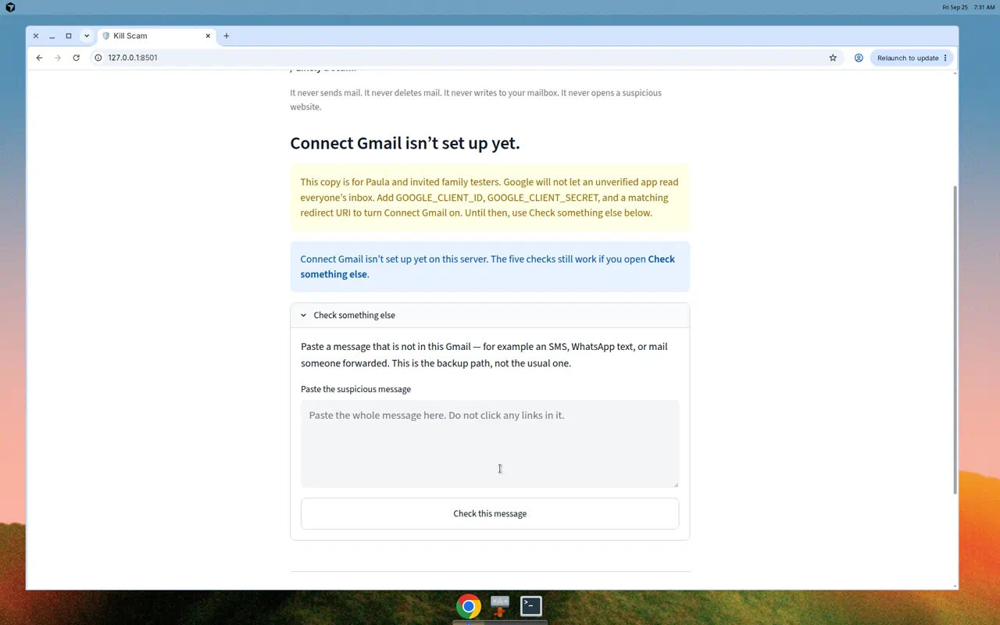
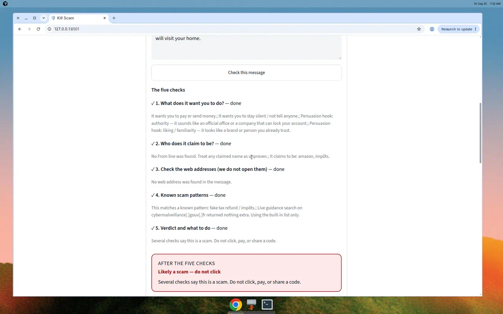

# Paste a message on your own computer

**TL;DR:** You can see how Kill Scam works by pasting a sample message on your laptop. **No Gmail OAuth is needed for this path. No Render (and no other hosted website) is needed.**

```text
Your computer
    |
    v
Open http://localhost:8501
    |
    v
Check something else  -->  paste a message
    |
    v
Five checks you can read
    |
    v
Looks OK  /  Be careful  /  Likely a scam
```

This page is a picture walk-through of that paste path. It does not connect to anyone’s inbox.

## What you need

- Python 3.11 or newer (the language the app is written in).
- A terminal (the text window where you type commands).
- A web browser.

You do **not** need:

- A Google account or Gmail permission screen
- A copy of `.env` filled in with keys
- A Render account, a public URL, or Docker

## Run it

These are the same commands as the [root README](../../README.md). On Windows, use `.venv\Scripts\activate` instead of `source .venv/bin/activate`.

```bash
git clone https://github.com/paula-strunz/kill-scam.git
cd kill-scam
python3 -m venv .venv
source .venv/bin/activate
pip install -e .
streamlit run src/kill_scam/app.py
```

Leave the terminal open. In the browser, go to `http://localhost:8501`.

You can skip `cp .env.example .env`. An empty environment is enough for paste. Do not put real passwords or API keys in the message box.

## What you click

1. The home screen says **Connect Gmail isn’t set up yet**. Leave that alone. Paste still works.
2. Open **Check something else**.
3. Paste the sample below into **Paste the suspicious message**.
4. Click **Check this message**.
5. Read the five lines, then the colored box.

Do not click any link inside a suspicious message. Kill Scam does not open those pages either.

The pictures below are from a local run of that same `streamlit` command, with no Gmail keys and no hosted URL.

### Empty paste box

The box starts blank. The button under it is **Check this message**.



### Sample to paste

This text is fake. It is fixture `scam-gift-card-pressure` in [`evals/fixtures.json`](../../evals/fixtures.json). It is not a real person’s mail.

```text
Hi, this is the tax office. You owe $2,480 that must be paid today with Amazon gift cards. Do not tell anyone. Send photos of the card codes to this number or police will visit your home.
```

### After you click Check

Each line gets a check mark and the word **done**. Then a pink box says **Likely a scam — do not click**.



| Step on screen | What it is looking at |
| --- | --- |
| 1. What does it want you to do? | Pay, send a code, click, stay quiet — and which pressure trick showed up |
| 2. Who does it claim to be? | The name in the message. A famous name is not proof |
| 3. Check the web addresses (we do not open them) | Links only. This sample has none, so the step says so |
| 4. Known scam patterns | Familiar tricks, such as a fake tax demand |
| 5. Verdict and what to do | **Looks OK**, **Be careful**, or **Likely a scam** |

For this sample the verdict is **Likely a scam — do not click**, with the line “Several checks say this is a scam. Do not click, pay, or share a code.” Under that, **What to do** says not to pay and not to use a phone number from the message.

## What this path does not do

- It does not ask you to sign in with Google.
- It does not need a website on Render, Fly, or anywhere else.
- It does not send, delete, or change email.
- It does not open the suspicious page.

Connect Gmail is a separate door. It needs the setup in [docs/SETUP.md](../SETUP.md). You can ignore that file for this demo.
