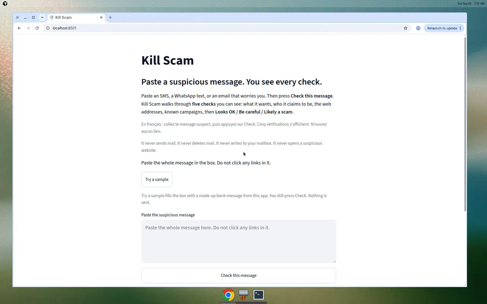
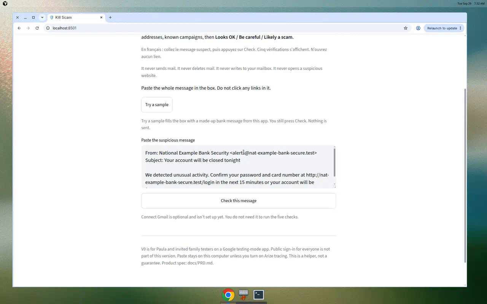
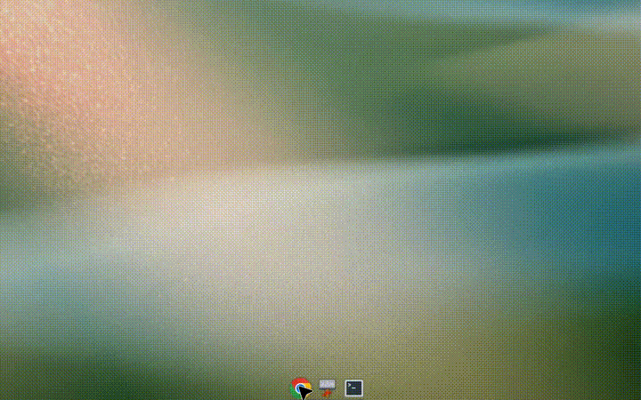
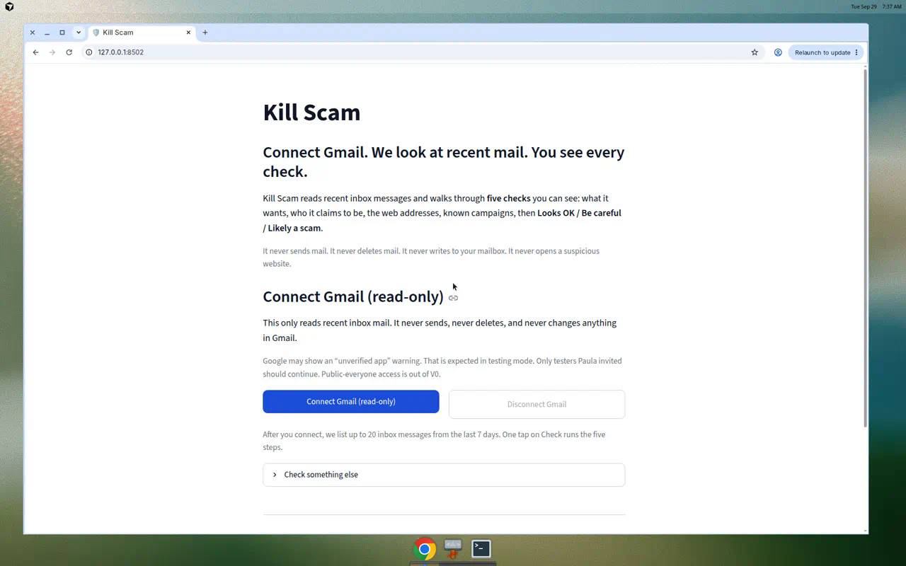

# Paste-first (Path B / #18)

**TL;DR:** When Gmail is not set up, the paste box is the home screen. **Try a sample** fills a made-up bank message. You still press **Check this message**. These pictures are that flow from [pull request #18](https://github.com/paula-strunz/kill-scam/pull/18). They are **not the screen on `main` yet**.

Gmail and OpenAI settings can stay blank. Do not click any link in the message. Kill Scam never sends mail and never deletes mail.

```text
Gmail not configured
        |
        v
Paste box is the home screen
        |
        v
Try a sample  -->  made-up bank message
        |            (nothing is sent)
        v
You press Check this message
        |
        v
Five checks you can read
        |
        v
Looks OK / Be careful / Likely a scam

Gmail is configured
        |
        v
Connect Gmail (read-only) stays first
        |
        v
Paste stays under Check something else
```

## Pictures

### 1. Home when Gmail is not set up

The headline is **Paste a suspicious message. You see every check.** The paste box is already open. There is no **Check something else** section to open. A note says Connect Gmail is optional and is not set up yet.



### 2. After Try a sample

**Try a sample** fills the box with a made-up bank message from this app. You still press **Check this message**. Nothing is sent.



The same click, as a short loop:



### 3. When Gmail is configured

Connect Gmail stays first. Paste moves under the collapsed **Check something else** backup. Paste-first is the home screen only when Gmail is not configured.



## What this path does not do

- It does not need Gmail, Google keys, or an OpenAI key. Those can stay blank.
- It does not need Render or any public website.
- It does not send mail, delete mail, or change the mailbox.
- It does not open a link from the message. Do not click those links yourself.

On `main` today, paste is still under **Check something else**. The paste-first home lands when [PR #18](https://github.com/paula-strunz/kill-scam/pull/18) is merged.
